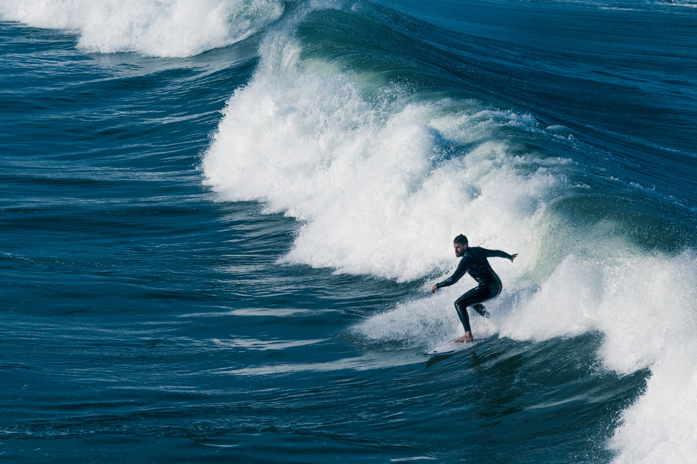

# ParalleX: Parallax Scrolling Adventure Webpage

## Business Objective
Showcase a visually engaging parallax scrolling effect for web portfolios or landing pages using only HTML and CSS.

## Problem Statement
Static web pages lack depth and interactivity. This project demonstrates a simple, reusable parallax template to boost user engagement.

## Business Constraints
- Pure HTML & CSS (no JavaScript)
- Smooth performance on modern browsers
- Desktop-focused layout
- All images are local

## Solution
- Layered background/foreground images with CSS 3D transforms
- Themed sections: Biking, Paragliding, Surfing
- Bold headings and adventure visuals

## Visualizations
- **Background image:**
  
  
- **Foreground image:**
  
  
- **Biking section:**
  
  
- **Paragliding section:**
  
  
- **Surfing section:**
  
  

## Results
- Smooth parallax effect
- Fast, offline-ready, and reusable template

## Conclusion
ParalleX proves advanced effects are possible with minimal code, serving as a resource and template for web designers.

---
**How to Run:** Open `index.html` in your browser or Visit Here .

**Author:** Pratik 
